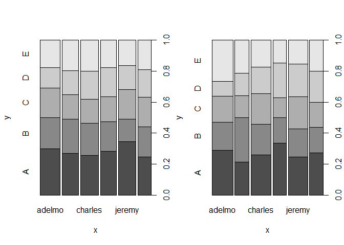
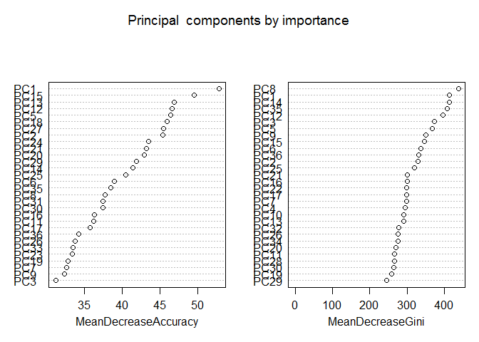

# Machine Learning Assignment
#### Executive Summary
The intent of this assignment is look at the data collected from a group of people who are part of the quantified self movement. Using this data, a model was created to predict what activity each member whose data was collected is performing. This model was then used to predict results for 20 test cases provided. A simple Random Forest model with three folds of data, repeated twice gave a model with 97.9 % accuracy. This then when tested against the test data gave all accurate results. Hence the model was not further fine tuned. 
The process of arriving at the model, its accuracy, out of sample error and prediction results are detailed in this assignment. 

#### Data Exploration

Reading the files. After initial read there were many observations which are either "NA" or had no value. Since neither will add any value to the model,  changed both values to be interpreted as "NA" at the time of read. This is then later used to remove columns which  are predominantly "NA".


```r
library(caret)
```

```
## Loading required package: lattice
## Loading required package: ggplot2
```

```r
train <- read.csv("./Machine/data/pml-training.csv", header = TRUE, na.strings = c("NA", ""))
test <- read.csv("./Machine/data/pml-testing.csv", header =TRUE, na.strings=c("NA",""))
```

In this section we draw a basic exploratory graph to find if ignoring NA rows  retains the original data file's distribution for "classe".


```r
smallTrain <- na.omit(train)
dim(train)
```

```
## [1] 19622   160
```

```r
dim(smallTrain)
```

```
## [1] 406 160
```

```r
par(mfrow=c(1,2))
plot(train$user_name, train$classe)
plot(smallTrain$user_name, smallTrain$classe)
```

 

Eliminating NA observations reduces the size of the new dataset to approximately  less than 5 percent of the original dataset. From the explorative graph it is also clear that the small set is not representative of the original data. Considering that there are many columns that are mostly NA's,ignoring them is more likely to give us a more robust model. The approach used for cleaning the data is

1. Use colSums to elimate NA or "" columns 
2. Eliminate the first seven columns as they are seq no,  user name,additive variables, timestamp and two flags with little change in values
3. Split the data into a training dataset tTrain ( 70% of training) and validation dataset vTrain (30% or training)


```r
naCols <- colSums(is.na(train))
train <- train[, naCols == 0]
test <- test[, naCols == 0]
train <- train[-c(1,2,3,4,5,6,7)]
test <- test[-c(1,2,3,4,5,6,7)]

dim(train)
```

```
## [1] 19622    53
```

```r
dim(test)
```

```
## [1] 20 53
```

```r
inTrain <- createDataPartition(y=train$classe,p=0.7, list=FALSE)
tTrain <- train[inTrain,]
vTrain <- train[-inTrain,]
```

#### Model creation
We will start with a principle component analysis to identify the variables contributing maximum to the variance. We will use a high cut-off of 99%.  The variables accounting for the most variability can be seen in this plot. We then use the preProc object obtained from the PCA for our model training and creation.


```r
preProc <- preProcess(tTrain[, -53], method = "pca", thresh = 0.99)
trainPC <- predict(preProc, tTrain[, -53])
validPC <- predict(preProc, vTrain[, -53])

tControl <- trainControl(method = "cv", number = 3, repeats = 2)
modelFit <- train(tTrain$classe ~ ., method = "rf", data = trainPC, trControl=tControl, importance = TRUE)
```

```
## Loading required package: randomForest
## randomForest 4.6-10
## Type rfNews() to see new features/changes/bug fixes.
```

```r
modelFit
```

```
## Random Forest 
## 
## 13737 samples
##    35 predictor
##     5 classes: 'A', 'B', 'C', 'D', 'E' 
## 
## No pre-processing
## Resampling: Cross-Validated (3 fold) 
## 
## Summary of sample sizes: 9157, 9158, 9159 
## 
## Resampling results across tuning parameters:
## 
##   mtry  Accuracy  Kappa  Accuracy SD  Kappa SD
##    2    0.965     0.956  0.000902     0.00115 
##   19    0.960     0.949  0.002713     0.00343 
##   36    0.950     0.936  0.004361     0.00552 
## 
## Accuracy was used to select the optimal model using  the largest value.
## The final value used for the model was mtry = 2.
```

```r
par(mfrow=c(1,2))
varImpPlot(modelFit$finalModel, main = "Principal  components by importance")
```

 

```r
prfValid <- predict(modelFit, validPC)
confusionMatrix(prfValid, vTrain$classe)
```

```
## Confusion Matrix and Statistics
## 
##           Reference
## Prediction    A    B    C    D    E
##          A 1670   21    2    1    0
##          B    3 1112   11    0    5
##          C    0    6 1004   32   19
##          D    1    0    9  928    4
##          E    0    0    0    3 1054
## 
## Overall Statistics
##                                           
##                Accuracy : 0.9801          
##                  95% CI : (0.9762, 0.9835)
##     No Information Rate : 0.2845          
##     P-Value [Acc > NIR] : < 2.2e-16       
##                                           
##                   Kappa : 0.9748          
##  Mcnemar's Test P-Value : NA              
## 
## Statistics by Class:
## 
##                      Class: A Class: B Class: C Class: D Class: E
## Sensitivity            0.9976   0.9763   0.9786   0.9627   0.9741
## Specificity            0.9943   0.9960   0.9883   0.9972   0.9994
## Pos Pred Value         0.9858   0.9832   0.9463   0.9851   0.9972
## Neg Pred Value         0.9990   0.9943   0.9954   0.9927   0.9942
## Prevalence             0.2845   0.1935   0.1743   0.1638   0.1839
## Detection Rate         0.2838   0.1890   0.1706   0.1577   0.1791
## Detection Prevalence   0.2879   0.1922   0.1803   0.1601   0.1796
## Balanced Accuracy      0.9960   0.9861   0.9834   0.9799   0.9867
```

```r
postResample(prfValid, vTrain$classe)
```

```
##  Accuracy     Kappa 
## 0.9801189 0.9748421
```
The model is reasonably accurate at 97.9 % . We will test the final outcome using this model. You will find later that this model predicts all 20 test cases accurately. No further model fine tuning was done for the purpose of this test.

The out of sample error rate(1-Accuracy) for this model  is fairly accurate as well and is 


```r
1-postResample(prfValid, vTrain$classe)[[1]]
```

```
## [1] 0.01988105
```

####Predicted Results


```r
testPC <- predict(preProc, test[, -53])
prfTest <- predict(modelFit, testPC)
test$classe<- prfTest
test[c("problem_id","classe")]
```

```
##    problem_id classe
## 1           1      B
## 2           2      A
## 3           3      B
## 4           4      A
## 5           5      A
## 6           6      E
## 7           7      D
## 8           8      B
## 9           9      A
## 10         10      A
## 11         11      B
## 12         12      C
## 13         13      B
## 14         14      A
## 15         15      E
## 16         16      E
## 17         17      A
## 18         18      B
## 19         19      B
## 20         20      B
```
